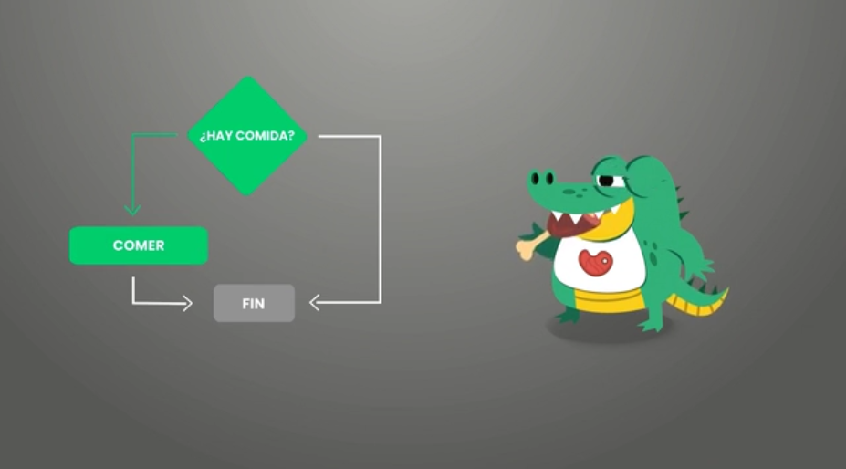

# Introducción a la programación

## Qué es la programación

Es el proceso de diseñar, codificar, depurar y mantener el código fuente de un programa de computadora.

Es el arte que nos permite representar por medio de código una de las muchas soluciones para resolver un problema. Cada programador tiene sus propias características.

La **creatividad** es una cualidad muy importante para un programador, necesitamos resolver problemas y debemos imaginar soluciones.

> Los pequeños detalles hacen una gran diferencia.

## ¿Cómo funciona la programación?

Le damos órdenes a la computadora para realizar una acción. En programación existen dos elementos importantes:
- **Código** Instrucciones que le damos a la computadora
- **Intérprete y/o compilador** Algunos lenguajes pueden ser interpretados y otros compilados. Este elemento nos permite el código a un lenguaje máquina (1 y 0)

> NO puedes usar un mismo lenguaje para todo, para eso existen distintas herramientas.

## ¿En dónde se utiliza la programación?

Se usa en todos lados. Los sistemas operativos y embebidos funcionan con código. No importa a lo que te dediques, simpre podrás dar solución a un problema.
De una pequeña idea surge grandes cosas.

> Cree en lo que haces y eso definirá tu futuro.

## Ventajas de ser programador. 
 
Algunas ventajas de ser programador son:
- La remuneración (USD$ 1600 - 1900)
- Puedes trabajar en cualquier lugar, tiene muchas salidas.
- Capacidad de resolver problemas desde diferentes perspectivas

**Importante** Hacer proyectos para ganar experiencia. Desarrollar Apps, páginas web, etc.

## Cualidades de un programador

- Creatividad
- Siempre estás aprendiendo
- Es autodidacta. (Hambre de aprender más y más)
- Perseverancia > Talento
- Comunicación. Ser claros y más si se trabaja en equipo

## Lenguajes de programación

Los lenguajes de programación nos permiten comunicarnos con la computadora.

**Qué es un lenguaje de programación**
Es un lenguaje que contiene reglas específicas que nos permiten realizar o controlar ciertas acciones en una computadora. Es el puente de comunicación entre la persona y la máquina. 

El intérprete traduce el código del lenguaje de programación a lenguaje máquina; binario (1 y 0).

Los lenguajes de programación se dividen en dos grupos:
- Lenguajes de alto nivel
- Lenguajes de bajo nivel

> NO hay mejor lenguaje, algunos hacen tareas mejor que otros. Todo depende de lo que quieras hacer.

## Lenguajes de Alto y Bajo Nivel

Cada uno de ellos tienen una característica importante

- **Lenguajes de alto Nivel** Los comprendemos mejor las personas. Algunos lenguajes de alto nvel son:
    - Python
    - PHP
    - Ruby
    - Java
    - C#

Las ventajas de ellos es que son portables, sencillos y fácil de leer y mantener el código

- **Lenguajes de bajo Nivel** Lo comprende mejor la máquina. Algunos lenguajes de bajo nivel son:
    - Ensamblador

La ventaja es que se compilan mucho más rápido y optimizan la memoria. 

- **Lenguajes de nivel medio** Por ejemplo **C**. No se pueden considerar de bajo nivel porque usa una sintaxis legible, y se puede manejar fácilmente el hardware de un equipo, escribiendo código optimizado.

## Lenguajes interpretados y compilados

Podemos clasificar los lenguajes en 2 tipos.

- **Lenguajes compilados** Usan un programa llamada compilador, para traducir el código a lenguaje máquina y crea un archivo ejecutable

- **Lenguajes interpretados** Usan un programa llamado intérprete, para poder traducir lo escrito a lenguaje máquina. El código es leido por el intérprete y no crea archivos ejecutables `.exe`

## Algoritmos

Es un conjunto de reglas ordenadas, definidas y finitas. Que nos permite realizar una actividad.

## Instalación de Python en windows

Debemos instalar el intérprete de python en windows para poder empezar a escribir nuestras primera líneas de código. También debemos descargar un editor de código. Puede ser Visual Studio Code.

*Para más información ver* [Python VSCode](https://codigofacilito.com/articulos/python-vsc)

**Para ver el contenido de python** ir al directorio [python](python)

